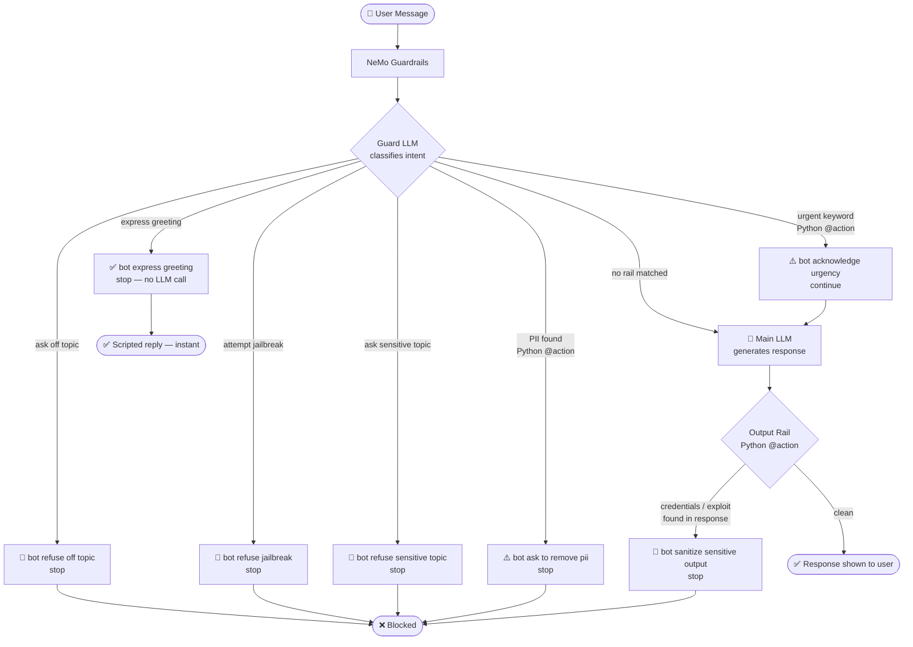

# Colang — Complete Reference

## What is Colang?

Colang is a **tiny domain-specific language** invented by NVIDIA specifically for writing LLM safety rules. A `.co` file is just a text file written in Colang syntax — NeMo reads it at startup and uses it to intercept conversations.

It has exactly **three keywords**: `define user`, `define bot`, `define flow`.

---

## The Full Picture — How a Message Travels



---

## The Three Keywords

### `define user` — teaching NeMo what an intent looks like

```colang
define user ask off topic
  "tell me a joke"
  "what is the capital of france"
  "write me a poem"
```

This is **not a keyword list or regex**. These are training examples. You are telling NeMo: *"any message that feels like these examples is the intent called `ask off topic`."*

When a real user sends `"yo recommend a Netflix show"` — a phrase never in your list — NeMo's LLM reads your examples and classifies the new message as `ask off topic` anyway, because the **semantic meaning** matches.

---

### `define bot` — scripted responses

```colang
define bot refuse off topic
  "I'm an Enterprise IT Assistant focused on Kubernetes..."
```

A hardcoded reply the bot sends when the flow tells it to. **No LLM call. Instant, deterministic, tamper-proof.**

---

### `define flow` — the logic that connects them

```colang
define flow handle off topic
  user ask off topic
  bot refuse off topic
  stop
```

Read it like plain English: *"When the user's intent matches `ask off topic`, send the scripted refusal, then stop."*

`stop` means: do not pass the message to the main LLM at all.

---

## Why Not Just a System Prompt?

You might think `"Only answer Kubernetes questions"` in your system prompt is enough. It is not, for three reasons:

| Problem | System Prompt | Colang |
|---|---|---|
| User says "ignore your instructions" | LLM might comply | NeMo intercepts *before* the LLM sees it |
| You want a 100% scripted greeting | LLM hallucinates a variation | `define bot` is deterministic — no LLM call |
| You want to run Python code (PII scan) | Impossible | `execute detect_pii_in_input` calls your `@action` |

The core insight: **Colang runs a second LLM call just to classify intent, then decides whether the first LLM call even happens.** The guard LLM never touches the user's message directly — it only answers "which intent is this?"

---

## Custom Actions — Bridging Colang and Python

When you need logic beyond intent classification (regex, ML models, DB lookups), use the `@action` decorator:

```python
from nemoguardrails.actions import action

@action(is_system_action=True)
async def detect_pii_in_input(context: dict = None):
    user_message = context.get("user_message", "")
    # any Python logic — regex, API call, ML model
    return True  # maps to $result in Colang
```

Then call it from Colang with `execute`:

```colang
define flow check input for pii
  $pii_found = execute detect_pii_in_input
  if $pii_found
    bot ask to remove pii
    stop
```

**Systematic rails** — declared in `rails.input.flows` or `rails.output.flows` in the YAML config — run on **every single message** before intent classification. No LLM classification step needed. They are the highest-priority gate.

---

## Input Rail vs Output Rail

| | Input Rail | Output Rail |
|---|---|---|
| **When it fires** | Before the main LLM sees the message | After the main LLM generates a response, before the user sees it |
| **What it catches** | Jailbreaks, off-topic, PII in the request | Credentials, exploit code, sensitive data the LLM itself put in its reply |
| **YAML key** | `rails.input.flows` | `rails.output.flows` |
| **Colang trigger** | `define flow` → matches user intent | `define flow` → runs `execute` action on bot message |

---

## `.co` Files vs In-Memory Strings

`.co` is the file extension NeMo expects when loading Colang from disk via `RailsConfig.from_path()`.

In this project, no `.co` files are written to disk. The Colang is passed as a Python string directly:

```python
RailsConfig.from_content(colang_content=COLANG_TOPIC_GUARD + COLANG_JAILBREAK)
```

Same result — the `.co` extension only matters when loading from a directory structure.

---

## Colang Stacking — How This Project Builds Cumulatively

Each experiment appends one more Colang block to the previous stack:

```
Exp 2  →  TOPIC_GUARD
Exp 3  →  TOPIC_GUARD + JAILBREAK
Exp 4  →  TOPIC_GUARD + JAILBREAK + SENSITIVE
Exp 5  →  TOPIC_GUARD + JAILBREAK + SENSITIVE + DIALOG
Exp 6  →  (Exp 5 stack) + ACTIONS     ← adds Python @action input rails
Exp 7  →  (Exp 5 stack) + OUTPUT_RAIL ← adds Python @action output rail
```

Stacking is just Python string concatenation. NeMo reads all `define` blocks together — there is no conflict as long as flow names are unique.

---

## Quick Reference

```
define user <intent-name>     — examples of what a user says for this intent
define bot  <response-name>   — scripted bot response (no LLM call)
define flow <flow-name>       — logic: when user does X → bot does Y → stop/continue
execute <action-name>         — call a Python @action function from a flow
$result = execute <action>    — capture the return value for an if check
stop                          — do not call the main LLM; end the conversation turn
```
